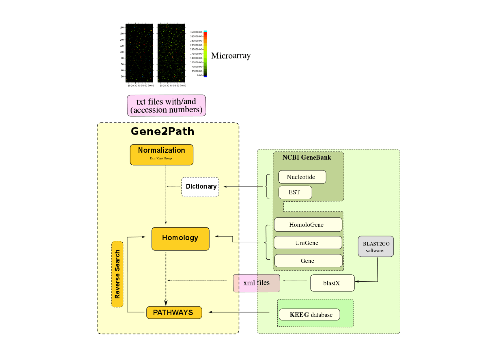

# gene2path

Most of the gene regulation pathways data from biochemical and molecular experiments are drawn from humans or from species commonly used as experimental animal models. Accordingly, the software packages to analyse these data on the basis of specific gene identification codes (IDs) or accession numbers (AN) are not easy to apply to other organisms that are less characterized at the genomic level. Here, we have developed the Gene2Path programme which automatically searches pathway databases to analyse microarray data in an independent, species-specific way. We have illustrated the method with data obtained from an immune targeted rainbow trout microarray to search for orthologous pathways defined for other well known biological species, such as zebrafish, although the software can be applied to any other case or species of interest. A user guide and examples are provided with the package. The Gene2Path software allows the automated searching of NCBI databases and the straightforward visualization of the data retrieved based on a graphic network environment.

More information: [N. Ballesteros et al., *J. Aquac. Res. Development* **6**, 329 (2015)](https://www.omicsonline.org/open-access/gene2path-a-data-analysis-tool-to-study-fish-gene-pathways-by-automatic-search-of-orthologous-genes-2155-9546-1000329.php?aid=47057)

# Authors
* Natalia A. Ballesteros ( naballesteros@gmail.com )
* Nestor F. Aguirre ( nfaguirrec@gmail.com )
* Julio Coll
* Sara I Pérez-Prieto
* Sylvia Rodríguez Saint-Jean

## Citing

To cite the code, please proceed as follows:

Scheme of the pathway analysis program and its search into different databases such as NCBI and KEGG. The diagram of Gene2Path is represented in the yellow cells, showing the automated steps of the program. The cells in green represent the databases or external programs used by Gene2Path. Arrows indicate the databases needed to follow up each one of the program steps. Into the rose cells are mentioned the archives extensions used by Gene2Path: txt are the gProccesedSignal of each of the genes from the microarray “input data”; the xml archives are obtained from the external program BLAST2GO and are used by the Gene2Path program to process and organize the blastX information. The Dictionary section provided, if needed, the gene identification codes (ID), obtained from the NCBI GeneBank for each one of the genes.

